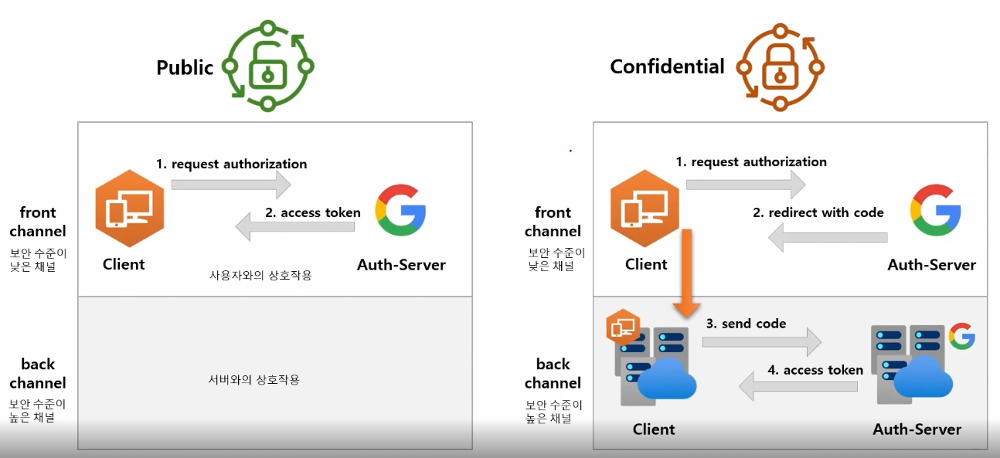

# OAuth 2.0

## Fundamentals

### Introduction

OAuth = Open + Authorization (RFC 6749)

- 어플리케이션이 사용자를 대신해서 사용자의 자원에 대한 제한된 액세스를 얻기 위한 승인 상호작용을 하는 것
- 사용자의 자원(보호된 자원)에 대한 접근에 대한 권한을 획득 하는 것
- Delegated authorization framework
  - 위임 인가 프레임 워크
  - 어플리케이션이 사용자의 데이터에 접근하도록 권한을 부여한다 

OAuth 2.0 이전 방식의 문제점

1. 아이디와 패스워드가 노출되어 보안에 취약하다
   - 물론 SSL을 통해 암호화가 가능하다
2. 모든 서비스에 대한 제한없는 접근이 가능
3. 클라이언트 어플리케이션을 신뢰할 수 없음

OAuth 2.0의 장점

1. 아이디와 패스워드로 로그인 할 필요가 없다
2. 서비스의 범위를 제한할 수 있다
3. 클라이언트 어플리케이션에 대한 신뢰여부를 판단할 필요가 없다

### Roles

- Resource Owner
  - 보호된 자원에 대한 접근 권한을 부여할 수 있는 주체
  - 즉, 자원의 주인이자 사용자
  - 사용자를 대신해서 작동하는 모든 클라이언트는, 우선적으로 `사용자의 허가`를 받아야한다
- Resource Server
  - 클라이언트에서 접근하는 사용자의 자원이 포함된 서버
  - 즉, 자원을 가진 서버
  - 액세스 토큰을 수락 및 검증할 수 있어야 한다
  - 권한 체계에 따라 요청을 승인할 수 있어야 한다
- Authorization Server
  - 클라이언트의 권한 부여 요청을 승인하거나 거부하는 서버
  - 사용자가 클라이언트에게 권한 부여 요청 승인은, 사용자가 인가서버에 클라이언트에게 권한 부여를 해야된다고 알려야한다
  - 사용자가 클라이언트에게 권한 부여 요청을 승인한 후, `access token`을 클라이언트에게 발급하는 역할
- Client
  - 사용자를 대신하여 권한을 부여받아 사용자의 리소스에 접근하는 어플리케이션
  - 사용자를 권한 부여 서버로 안내하거나, 상호작용 없이 권한 부여 서버로부터 직접 권한을 얻을 수 있따.

## Client Types

Client 는 사용자를 대신해서 사용자가 속한 `Resource server`에게 사용자의 자원을 가지고와서 사용하기 위한 어플리케이션.
인증 서버에서 클라이언트를 등록할 때, 자격 증명인 `client id`와 `secret` 을 받게된다.

### 기밀 클라이언트(Confidential)

기밀 클라이언트는 `client secret`의 기밀성을 유지할 수 있는 클라이언트

- 일반적으로 사용자가 소스코드에 액세스할 수 없는 서버에서 실행되는 응용프로그램
- 서버측 언어로 작성된다(Java, PHP, Node.js)
- 이런 유형의 어플리케이션은 웹 서버에서 실행되기 때문에 일반적으로 `웹 앱`이라고 한다

### 공개 클라이언트(Public)

공개 클라이언트는 `client secret`의 기밀을 유지할 수 없고, secret 이 사용되지 않는다

- 브라우저(SPA)에서 실행되는 JavaScript 어플리케이션, Android, IOS 등
- 디스어셈블러나 디버깅 도구를 통해 바이너리, 실행 코드를 통해 기밀 정보를 추출할 수 있기에 공개로 간주한다
- 서버측이 아닌 리소스 소유자가 사용하는 장치에서 실행되는 모든 클라이언트는 공개 클라이언트

## Token Types

### Access Token

클라이언트에서 사용자의 보호된 리소스에 접근하기 위해 사용하는 일종의 자격 증명

- `Resource Owner`가 클라이언트에게 부여한 권한의 표현
- 일반적으로 JWT 형식을 취하지만 사양에 따라 그럴 필요는 없음
- 토큰에는 액세스 기간, 범위, 서버에 필요한 기타 정보가 존재
- 식별자(Identifier) 타입과 자체포함(Self-contained) 타입이 있다
  - 식별자 타입
    - 토큰 안에 유의미한 정보가 포함되어 있지않다, 단순한 식별자의 역할
    - 인증서버에 토큰의 내용을 저장하고 있기 때문에, 리소스 서버에서 인증 서버로 토큰 유효성과 정보를 검사한다
    - 따라서, 인증서버에 대한 채널을 오픈해야되고 네트워크 비용이 증가한다
  - 자체포함 타입
    - 토큰 안에 유의미한 정보가 포함되어 있다, JWT.
    - 리소스 서버는 인증서버와 통신할 필요없이 자체 포함된 토큰의 유효성을 검증할 수 있다.
    - 특정 암호화 알고리즘에 의해 개인키로 서명되고 공개키로 검증할 수 있다.

### Refresh Token

액세스 토큰이 만료된 후 액세스 토큰을 얻기 위해 클라이언트에서 사용하는 자격 증명

- 만료된 경우, 클라이언트는 인증서버로 `refresh token` 을 전달
- 인증서버는 `refresh token `의 유효성을 검증하고 새로운 액세스 토큰을 전달한다

### ID Token

향후 추가

### Authorization Code

- 실습 중에 response type 을 code 로 해서 전달했을 때 받는 값
- 권한 부여 흐름에서 사용되며, 클라이언트가 `액세스 토큰과 교환하는 임시 코드`이다.

## Grant Type

### 매개변수 용어

- client id
  - 인가서버에 등록된 클라이언트의 고유한 키
- client secret
  - 인가서버에 등록된 클라이언트의 client id 에 대한 비밀 키
- response type
  - 어플리케이션이 권한 부여 코드 흐름을 진행하고 있음을 인증 서버에 알림
  - code, token, id_token 의 타입이 있으며, token, id_token 은 implicit 권한 부여 유형에서 지원
  - 서버가 쿼리 문자열에 인증코드, 코드등을 반환한다
- grant_type
  - 권한 부여 타입 지정
  - authorization code, password, client credentials, refresh token
- redirect_uri
  - 사용자가 클라이언트를 성공적으로 승인하게 되면, 권한 부여 서버가 사용자를 다시 클라이언트로 리디렉션
  - 초기 권한 요청에 포함되는 경우에도 이를 포함해야하며, 이 경우에는 토큰 발행 때에도 동일하게 요청해야하며 이 둘은 일치해야한다.
- scope
  - 클라이언트가 사용자 데이터에 접근하는 것을 제한하기 위해 사용
  - 특정 스코프로 제한된 인가 권한을 발행함으로서, 데이터 접근을 제한한다.
- state
  - 클라이언트는 임의의 문자열을 생성하여 요청하고, 사용자에 의해 승인된 후 동일한 값이 반환되는지 확인
  - CSRF 공격을 방지하는데 사용한다

