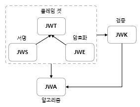

# Spring OAuth 2.0

<p align="center"></p>

## OAuth 2.0 Resource Server

- 클라이언트 및 인가서버와의 통신을 담당하는 리소스 서버의 기능을 필터 기반 모듈로 구현
- 클라이언트의 리소스 접근 제한, 토큰 검증을 위한 인가서버와의 통신 등의 구현이 가능
- 권한 관리를 별도 인가 서버에 위임하는 경우 사용 가능
  - 요청을 인가할 때 이 인가 서버에 확인하여 진행

### 환경 설정 파일

OAuth2ResourceServerProperties

- yml 환경설정 파일을 매핑해서 사용
- prefix : spring.security.oauth2.resourceserver
- 속성
  - jwkSetUri: 인가 서버에서 서명한 토큰의 위치
    - 인가 서버가 발급한 공개키의 정보를 찾을 수 있는 엔드 포인트
  - issuerUri: 인가 서버의 위치
    - 인가 서버가 발급할 JWT 토큰에 추가되는 값으로, `발급자(issuer)`
  - publicKeyLocation: 공개키를 가지고 있는 파일 위치
  - jwsAlgorithm: jwt 토큰을 서명하기 위한 알고리즘
  - introspectionUri: 토큰 검증을 위한 introspection 엔드 포인트
- 위 속성 중에서 `jwk-set-uri` 와 `issuer-uri` 중 한개는 반드시 필요하지만, 나머지는 필요시 설정

```text
인가서버 메타 데이터 엔드포인트 (Provider 설정 엔드포인트)
issuer-uri 프로퍼티를 사용하려면 인가 서버가 지원하는 엔드 포인트는 반드시 세 가지 중 하나여야한다
1. /issuer/.well-known/openid-configuration
2. /.well-known/openid-configuration
3. /.well-known/oauth-authorization-server/issuer
```

### AuthenticationEntryPoint

<p align="center"></p>

사용자가 인증을 받지 않았을 때, 인증을 받을 수 있도록 인증의 진입점으로 연결시켜 주는 역할.
`AuthenticationEntryPoint`에는 다양한 구현체가 있으므로, 각 EntryPoint 가 어떨 때 어떤 기준으로 실행되는지 파악해야한다.
`OAuth2ResourceServerConfigurer`를 보면 default 로 `BearerTokenAuthenticationEntryPoint`가 입력된다.

### oauth2ResourceServer().jwt()

<p align="center"></p>

#### 검증 프로세스

- 프로퍼티를 설정하면 JWT로 인코딩한 Bearer 토큰을 검증하는 리소스 서버가 자동으로 설정
- OIDC provider 설정 엔드포인트 또는 인가 서버 메타데이터 엔드포인트를 검색해서 jwk-set-uri 엔드포인트를 찾아 검증을 진행
- 다음 두 가지 검증 전략을 설정
  - 인가서버의 jwk-set-uri 엔드포인트로 유효한 공개키를 가져와서 검증 전략을 설정
  - issuer-uri 에 대한 각 JWT 클레임을 검증할 전략을 설정

#### 검증 순서

1. 클라이언트가 Bearer 토큰을 Authorization 헤더에 담아 요청한다
   - 클라이언트는 인가서버로부터 권한부여 요청을 하게되고, 인가서버로부터 privateKey로 서명된 토큰을 발급받게 된다
2. 리소스 서버는 요청한 토큰이 Bearer 토큰 사양에 합당한지 검사
3. 인가서버는 JWT 토큰에 서명한 개인키와 매칭하는 공개키를 jwk-set-uri 엔드포인트 요청으로 가져와서 첫 번째 검증을 진행
4. JWT에 있는 클레임정보가 기준에 부합하는지 두 번째 검증을 진행
5. 검증에 성공하면 JWT 객체를 생성하고 클레임 정보에 있는 scope를 추출해서 시큐리티 권한에 매핑
6. Authentication 객체를 생성하고 JWT 객체를 principal 속성에 저장
7. Authentication을 SecurityContext에 저장하고 인증을 완료

## JCA(Java Cryptography Architecture) & JCE(Java Cryptography Extension)

자바는 JCA & JCE 프레임워크를 통해 자체적인 보안관련 기능을 제공
- 전자서명, 메시지 다이제스트, 인증서와 인증서 유효성 검사, 키 생성 및 관리 등을 제공
- JCA & JCE 프레임워크는 `프로바이더 보안 구조`를 사용, 보안과 관련한 다양한 API 제공
  - java.security.Provider 클래스의 구현체

### Message Digest

원본파일이 변조되었는지 아닌지에 대한 `무결성 검사`

- 입력값으로 전달된 다양한 길이의 원본값을 `고정 길이 해시 값`으로 출력
- `단방향 암호화`이기에 해시 값에서 다시 원본값으로 복호화 할 수 없다 

### Signature

<p align="center"></p>

초기화 시 제공받은 키를 사용해서 `데이터를 서명`하고, `전자 서명의 유효성을 검증`하는데 사용

- 서명
  - Signature 객체는 제공된 원본 데이터를 `개인 키로 서명`하고, 결과로 `Signature Bytes`를 반환
- 검증
  - 검증이 필요한 경우에 개인 키와 대칭되는 공개 키를 제공
  - 검증은 공개키와 함께 원본 데이터를 `update()`하여 Signature 객체를 생성하고, 이를 개인 키의 서명한 결과인 
  Signature Byte 와 비교(`verify()`)한다
- 서명은 메시지 다이제스트와 비대칭키 암호화가 결합한 형태

### Symmetric Key Algorithm(대칭키 암호)

<p align="center"></p>

암호와와 복호화에 같은 암호키를 쓰는 알고리즘, 즉 암복호화를 위해 같은 암호키를 공유해야한다.
비대칭키 암호와 비교하여 계산 속도가 빠르다는 장점을 가진다

- Message Authentication Code(MAC)
  - 메시지 인증 코드는 `데이터 변조를 검증`할 수 있도록 `데이터에 덧붙이는 코드`
  - 해시 값 생성하는 점에서는 메시지 다이제스트와 비슷하지만, 초기화 시 대칭키를 요구한다
  - 즉, 메시지 다이제스트와 달리 `오직 대칭키를 가진 대상만` 무결성 검사가 가능
  - 암호화 해시 함수(MD5, SHA256 등)를  기반으로 하는 MAC이 `HMAC`
    - HMAC 은 메시지 다이제스트와 비밀 키의 조합

### Asymmetric Key Algorithm(비대칭키 암호)

<p align="center"></p>

암호화와 복호화에 다른 암호 키를 사용하는 알고리즘이다.
외부에 노출되어서는 안되는 개인키(Private Key)와 공개적으로 개방하는 공개키(Public Key)의 쌍으로 구성된다.
상호간의 암복호화가 이루어지며 한 쪽이 개인키로 암호화했다면 반대쪽은 공개키로 복호화하는 구조, 그 반대도 성립한다.

- 데이터 보안
  - 송신자가 공개키로 암호화 -> 송신자의 개인키로만 복호화
  - 데이터를 안전하게 전송
- 인증
  - 송신자가 개인키로 암호화 -> 송신자의 공개키가 아닌 다른 공개키로는 복호화가 안됨(부인방지)
- RSA
  - 현재 SSL/TLS에 가장 많이 사용되는 공개키 암호화 알고리즘
  
## JCA 와 JCE 구조

### Cipher

- 암호화 및 복호화에 사용되는 암호화 암호의 기능 제공
  - 즉, 키를 통해 일반 텍스트를 암호화 하거나, 암호화된 데이터를 키를 통해 일반 텍스트로 복호화 하는 과정
- 인스턴스 생성시 변환을 지정
  - `암호화 알고리즘/피드백 모드/패딩` 또는 `암호화 알고리즘` 으로 지정
  - `RSA/ECB/OAEPWithSHA1AndMGF1Padding` or `RSA`
- 초기화
  - 작동 모드인 `opmode`와 Key 또는 증명서를 인자로 전달
  - `opmode`
    - ENCRYPT_MODE
    - DECRYPT_MODE

### Key

`Key`는 JCA가 지원하는 모든 종류의 키에 대한 최상위 인터페이스이다.
PublicKey, PrivateKey, SecretKey(대칭키)가 존재한다.

## JWT & JWK

### JOSE(JSON Object Signing and Encryption)

<p align="center"></p>

- JSON 데이터의 컨텐츠를 암호화하고 서명의 형태로 나타내기 위해 IETF에서 표준화한 소프트웨어 기술셋
- 다음 사양이 포함되어 있음
  - JWT(JSON Web Token)
    - 클레임 기반 보안 값을 나타내는 방법
    - 인증, 권한 부여 및 정보 교환에 사용
    - JWS 또는 JWE 방식으로 구현된다
  - JWS(JSON Web Signature)
    - 디지털 서명 또는 MAC으로 보안된 콘텐츠를 표현하는 방법
    - 대부분 이 방식으로 표현
  - JWE(JSON Web Encryption)
    - 의도한 수신자만 읽을 수 있도록 암호화된 토큰을 나타내는 형식
  - JWK(JSON Web Key)
    - HMAC 이나 RSA 알고리즘을 사용해 공개 키 세트를 JSON 객체로 나타내는 구조
  - JWA(JSON Web Algorithm)
    - JWS, JWK 및 JWE에 필요한 알고리즘 목록
    - 어떤 알고리즘으로 서명할 것이냐

### JWS

<p align="center"></p>

- JOSE Header
  - 일반적으로 JWT인 토큰 유형과 HMAC SHA256 또는 RSA 같은 서명 알고리즘의 두 부분으로 구성
  - `Base64Url`로 인코딩 되어 `JWT의 첫 부분을 형성`
- Payload(JWT Claim set)
  - 토큰에 포함될 내용인 클레임을 포함하는 페이로드
  - 표준 필드인 7개의 등록 클레임 이름 및 사용자 지정 클레임 등으로 구성
  - `Base64Url`로 인코딩 되어 `JWT의 두 번째 부분을 형성`
- Signature
  - Base64Url 인코딩 되어 헤더와 페이로드를 인코딩하고 이 둘을 `.`으로 구분하여 연결

### JWK

- 암호화 키를 저장하는 방식
- 인가서버에서 발행하는 JWT 토큰의 암호화 및 서명에 필요한 암호화 키의 다양한 정보를 담은 JSON 객체 표준
- JwkSetUri 정보를 설정하게 되면 인가서버로부터 JWK 형태의 정보를 다운로드 할 수 있고 JWT를 검증할 수 있다
- JWK 확장
  - 자바 표준 보안 클래스를 사용해 대칭, 비대칭 키 방식의 JWT의 암호화 및 전자서명 그리고 이후 검증을 위한 키 생성, 변환을 지원
  - 구현체로서 RSAKey, OctetSequenceKey, OctetKeyPair 가 존재

### Opaque Token

JWT 포맷으로 된 액세스 토큰은 키만 있으면 인가서버로 가서 검증을 받을 필요가 없지만, `Opaque 토큰`은 
원격(엔드포인트)으로 검증을 처리하는 방식이다. 즉, Bearer token 은 `리소스 서버에서 처리하는 자체검증`,
Opaque token 은 `인가서버 에서 처리하는 원격 검증`이다.