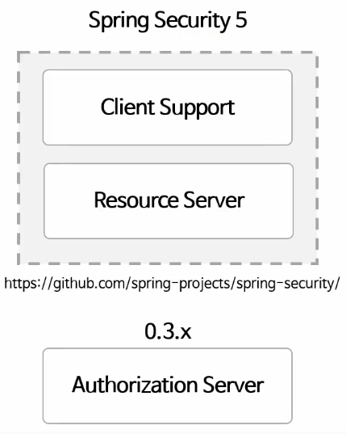
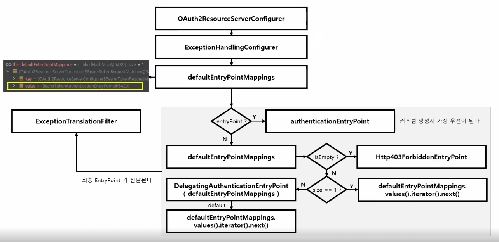

# Spring OAuth 2.0

<p align="center"></p>

## OAuth 2.0 Client

현재 필요한 내용은 서버 구현과 관련된 내용이므로 Resource Server 와 Authorization Server 먼저 학습 후 작성

## OAuth 2.0 Resource Server

- 클라이언트 및 인가서버와의 통신을 담당하는 리소스 서버의 기능을 필터 기반 모듈로 구현
- 클라이언트의 리소스 접근 제한, 토큰 검증을 위한 인가서버와의 통신 등의 구현이 가능
- 권한 관리를 별도 인가 서버에 위임하는 경우 사용 가능
  - 요청을 인가할 때 이 인가 서버에 확인하여 진행

### 환경 설정 파일

OAuth2ResourceServerProperties

- yml 환경설정 파일을 매핑해서 사용
- prefix : spring.security.oauth2.resourceserver
- 속성
  - jwkSetUri: 인가 서버에서 서명한 토큰의 위치
    - 인가 서버가 발급한 공개키의 정보를 찾을 수 있는 엔드 포인트
  - issuerUri: 인가 서버의 위치
    - 인가 서버가 발급할 JWT 토큰에 추가되는 값으로, `발급자(issuer)`
  - publicKeyLocation: 공개키를 가지고 있는 파일 위치
  - jwsAlgorithm: jwt 토큰을 서명하기 위한 알고리즘
  - introspectionUri: 토큰 검증을 위한 introspection 엔드 포인트
- 위 속성 중에서 `jwk-set-uri` 와 `issuer-uri` 중 한개는 반드시 필요하지만, 나머지는 필요시 설정

```text
인가서버 메타 데이터 엔드포인트 (Provider 설정 엔드포인트)
issuer-uri 프로퍼티를 사용하려면 인가 서버가 지원하는 엔드 포인트는 반드시 세 가지 중 하나여야한다
1. /issuer/.well-known/openid-configuration
2. /.well-known/openid-configuration
3. /.well-known/oauth-authorization-server/issuer
```

### AuthenticationEntryPoint

<p align="center"></p>


사용자가 인증을 받지 않았을 때, 인증을 받을 수 있도록 인증의 진입점으로 연결시켜 주는 역할.
`AuthenticationEntryPoint`에는 다양한 구현체가 있으므로, 각 EntryPoint 가 어떨 때 어떤 기준으로 실행되는지 파악해야한다.
`OAuth2ResourceServerConfigurer`를 보면 default 로 `BearerTokenAuthenticationEntryPoint`가 입력된다.